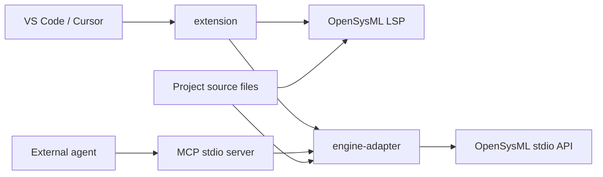

# Product architecture

**English** | [简体中文](architecture.zh-Hans.md)

Systrace is a VS Code/Cursor extension. OpenSysML provides SysML semantics; the extension, engine adapter and MCP server provide editor integration, project sessions and read-only agent tools: `validate`, `find_element`, `describe_element`, `library_lookup`.

The engine is maintained in `dryas-labs/OpenSysML`. `config/engine.json` specifies the tested engine version and source commit. Updating the engine repository does not automatically update the product.

## Projects and processes

Each editor workspace uses a separate LSP client. Its model source roots are sent
to the same workspace engine to preserve cross-file resolution. LSP and API use
the same configured engine version and bundled standard library, but manage separate
processes and model state. Engine-specific environment overrides are removed from
child processes. This first version does not support replacing the standard library
or loading external analysis tools through environment variables.

The engine returns standard-library locations as `sysml-stdlib:` URIs. After checking
the `openSysmlStdlibContent` capability, the extension reads source through
`opensysml/stdlibContent` and registers a read-only document provider. Each project
has its own editor URI scheme. The language client converts LSP messages back to the
engine's original URIs, leaving library hover and navigation to the engine. A random
project identifier persists in editor workspace state across restarts; library URIs
do not contain project paths. Reconnection refreshes open library documents. Reads
support cancellation and the configured timeout; delayed responses from an old
connection are not presented as new content.

The API uses native Content-Length framing and JSON-RPC messages. The adapter
checks the engine version and required capabilities before sending the full model's
file contents. Requests are serialized per project, with a queue limit of 8 and a
default timeout of 30 seconds. A timeout or cancellation disposes of the process.
At most one automatic reconnection is allowed; after that, a new session is required.
Failed requests are not automatically retried or disguised as validation results.

Model files are read as UTF-8. Paths must remain inside the project, and symlinks or
junctions in model directories are rejected. Hidden directories and `node_modules`
are excluded from scanning. Source trees containing `selection` or `designs` are
rejected; configure actual model folders instead. Limits are 2,000 files, 2 MiB per
file, 32 MiB total and 4,000 directories. These are product resource limits, not
language restrictions or semantic acceptance criteria.

## Saved snapshots and results

A session has a random `sessionId`. Changes to file content, names or source roots
increment `projectRevision`. A request retains immutable input bytes and rereads
the files after the engine responds; concurrent changes invalidate the result.
Validation pages and filtered scopes share a revision, and edits invalidate old
cursors. The product does not generate file-digest inventories for users.

`validate` always checks the complete saved project; `paths` only filters the display.
Results include project-wide and filtered error/warning totals, original diagnostic
messages, native codes, locations, categories and pagination cursors. Unknown codes
remain `UNCLASSIFIED`. Categories are assigned by the adapter using diagnostic codes from the engine.

`errors` takes precedence over `incomplete`. This version lacks evidence for returning
`clean`: the native API supplies diagnostics but no completeness proof or independently
verifiable standard-library version. All three `completeness` fields explicitly remain
`unknown`. Absence of diagnostics does not establish complete checking. L1 engine
checks, L2 task assertions and L3 engineering correctness are separate levels.

## Configuration and privacy

`config.example.js` is the generic template. Developers put local configuration in
the ignored `config.js`. Development and test scripts read engine and editor locations
from it. Installed extension settings are managed by the editor, and the MCP CLI uses
startup arguments. Neither executes an arbitrary `config.js` from a model project.

Private personal information, absolute machine paths, device identifiers, time zones,
credentials and raw execution logs stay out of product source and documentation.
Public GitHub identities may be used for commit attribution. Content checks report
only matching files and rules, without echoing sensitive values. Packaging uses a
file allowlist.

## Current boundaries

There is no graphical editing, view rendering, built-in agent, database or DRYAS SysML
parser.
Native standards conformance, general interactive performance and release readiness
still require validation; small examples and development-host tests do not establish them.

References: [VS Code LSP guide](https://code.visualstudio.com/api/language-extensions/language-server-extension-guide),
[extension testing guide](https://code.visualstudio.com/api/working-with-extensions/testing-extension),
[MCP TypeScript SDK](https://github.com/modelcontextprotocol/typescript-sdk).

Engine compatibility and downstream maintenance responsibilities are described in the [engine support policy](engine-support.md).
