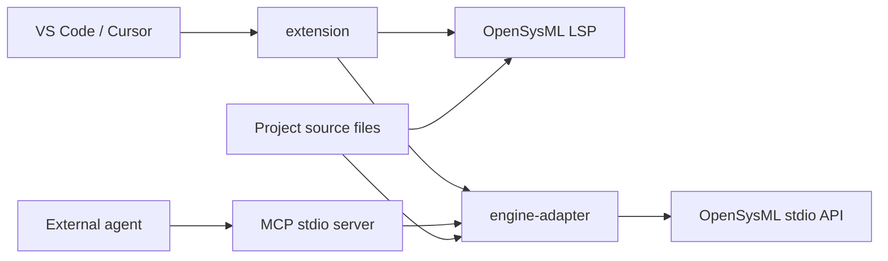

# 产品架构

[English](architecture.md) | **简体中文**

Systrace 是 VS Code/Cursor 扩展。OpenSysML 提供 SysML 语义；扩展、引擎适配层和 MCP 服务负责编辑器接入、项目会话和只读 agent 工具：`validate`, `find_element`, `describe_element`, `library_lookup`。

引擎在 `dryas-labs/OpenSysML` 中维护。`config/engine.json` 指定已测试的引擎版本和源码提交；更新引擎仓库不会自动升级产品。

## 项目与进程

每个编辑器工作区使用独立 LSP 客户端。多个模型源码根目录送入同一个工作区引擎，保留跨文件
解析能力。LSP 与 API 使用相同配置版本及内置标准库，分别管理进程和模型状态。
引擎专用环境覆盖在子进程中清除，第一版不支持用环境变量替换标准库或加载外部分析工具。

标准库位置由引擎以 `sysml-stdlib:` URI 返回。扩展核对 `openSysmlStdlibContent` 能力后，
通过 `opensysml/stdlibContent` 读取该引擎持有的源码，并注册只读文档提供器。每个项目使用独立
的编辑器 URI scheme；LSP 消息在客户端边界转换回引擎原始 URI，使库内悬停和跳转仍由引擎处理。
项目对应的随机标识保存在编辑器工作区状态中，重启后复用；不将项目路径写入标准库 URI。
引擎重连会刷新已打开的库文档。读取支持取消和配置超时，旧连接的延迟响应不会当作新内容展示。

API 采用原生 Content-Length 帧和 JSON-RPC 消息。适配层先核对版本和所需能力，再提交整个
模型的文件内容。每个项目串行处理，队列上限 8；请求超时默认 30 秒。超时或取消会回收进程，
最多自动重新建立一次连接，随后需要重新创建会话。失败请求不自动重做或伪装成验证结果。

模型文件以 UTF-8 读取。路径限定在项目中，拒绝模型目录内的符号链接/junction。
隐藏目录及 node_modules 不参与扫描；包含 selection 或 designs 的源码树被拒绝，要求改选
真正的模型文件夹。上限为 2,000 个文件、单文件 2 MiB、总计 32 MiB 和 4,000 个目录。
这些是当前产品资源限制，不是语言限制或语义门槛。

## 保存快照与结果

一次会话有随机 sessionId；文件内容、命名或源码根变化时增加 projectRevision。
请求保存不可变的输入字节，并在引擎返回后再次读取比较；检测到并发修改则拒绝结果。
验证页和筛选范围绑定同一版本，修改后旧游标失效。没有给用户生成文件摘要清单。

`validate` 始终验证整个保存项目，paths 只过滤显示。返回项目与筛选范围的错误/警告总数、
诊断原文、原生代码、位置、类别及分页游标。未知代码保留为 UNCLASSIFIED。
适配层根据引擎诊断代码确定类别。

状态优先级为 errors 高于 incomplete。第一版没有返回 clean 的证据：原生 API 虽返回诊断，
却没有完整性证明和独立可核对的标准库版本。三项 completeness 均明确为 unknown，
不能靠缺少诊断推断检查全面完成。L1 引擎检查、L2 任务断言与 L3 工程设计成立是不同层次。

## 配置和隐私

config.example.js 是通用模板；config.js 是开发者填写的本地配置，禁止跟踪。
开发/测试脚本从中获得引擎与编辑器位置。插件安装后的设置由编辑器管理，MCP CLI 使用启动参数，
不会读取并执行模型项目中的任意 config.js。

非公开个人信息、本机绝对路径、设备标识、时区、凭据和原始运行日志均不进入产品源码或文档。
公开的 GitHub 身份可以用于提交署名。
源码内容检查只报告命中的文件和规则，不回显敏感值。实际打包采用文件白名单。

## 当前边界

没有图形编辑、view 渲染、产品自有 agent、数据库或自研 SysML 解析器。
原生标准一致性、通用交互性能及发布条件仍需继续验证；
小型示例和开发宿主测试不能替代这些结论。

参考：[VS Code LSP 指南](https://code.visualstudio.com/api/language-extensions/language-server-extension-guide)、
[扩展测试指南](https://code.visualstudio.com/api/working-with-extensions/testing-extension)、
[MCP TypeScript SDK](https://github.com/modelcontextprotocol/typescript-sdk)。

引擎兼容范围与下游维护责任见[引擎支持政策](engine-support.zh-Hans.md)。
